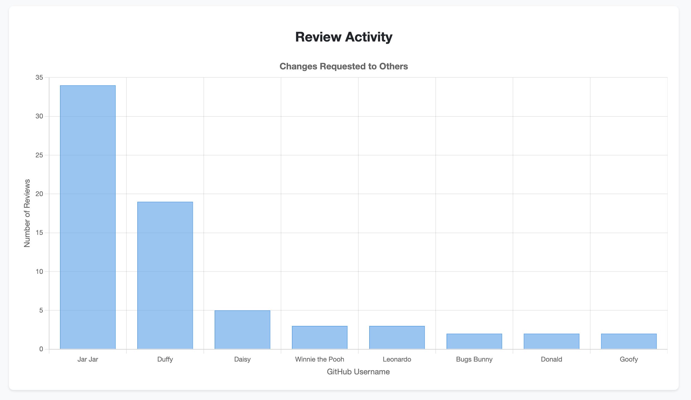
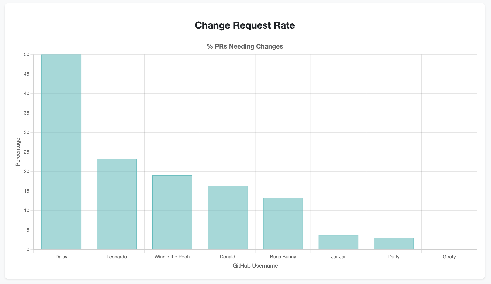
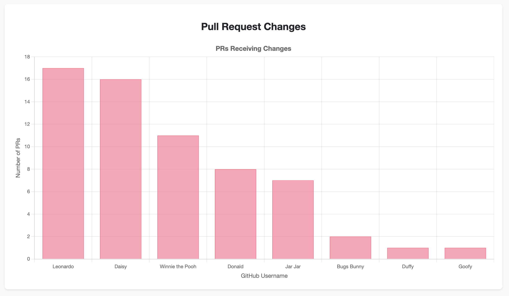

# PR Data Insights

This simple node app helps engineering managers understand their team's _Request for Changes_ utilization in PRs and thus better understand code review practices and identify bottlenecks. This is not inteded as a full-fledged tool, but rather a quick way to get an overview of the team's PR review practices or something that you can use to have a conversation with your team about their PR review practices.

The app fetches PR data from a GitHub repository of your choice and generates [chart.js](https://github.com/chartjs) based visualizations about team members' review behaviors in relation to _Request for Changes_.

## Features

- **PR Review Analytics**: Track and visualize how often team members' PRs receive or give change requests
- **Change Request Ratios**: Understand the percentage of PRs that require changes for each team member
- **Interactive Visualizations**: Responsive charts powered by Chart.js

## Setup

1. Clone the repository
2. Install dependencies:
   ```bash
   npm install
   ```
3. Configure your GitHub access:
   - Create a GitHub personal access token
   - Update the configuration in `index.js` with your:
     - Repository owner
     - Repository name
     - GitHub token

## Usage

1. Run the data fetcher:

   ```bash
   npm start
   ```

   This will generate a `pr_metrics_2024.json` file with the PR statistics. You can change the year in the `index.js` file.

2. Open `index.html` in a web browser to view the visualizations:
   - PRs Receiving Changes
   - Review Activity
   - Change Request Rate

I recommend using either `npx http-server` or `python -m http.server` to serve the `index.html` file.

## Example Results







## License

This project is licensed under the MIT License - see the [LICENSE](LICENSE) file for details.

## Author

Jakub Svoboda, but powered by Cursor to speed up the development process. 🤓
